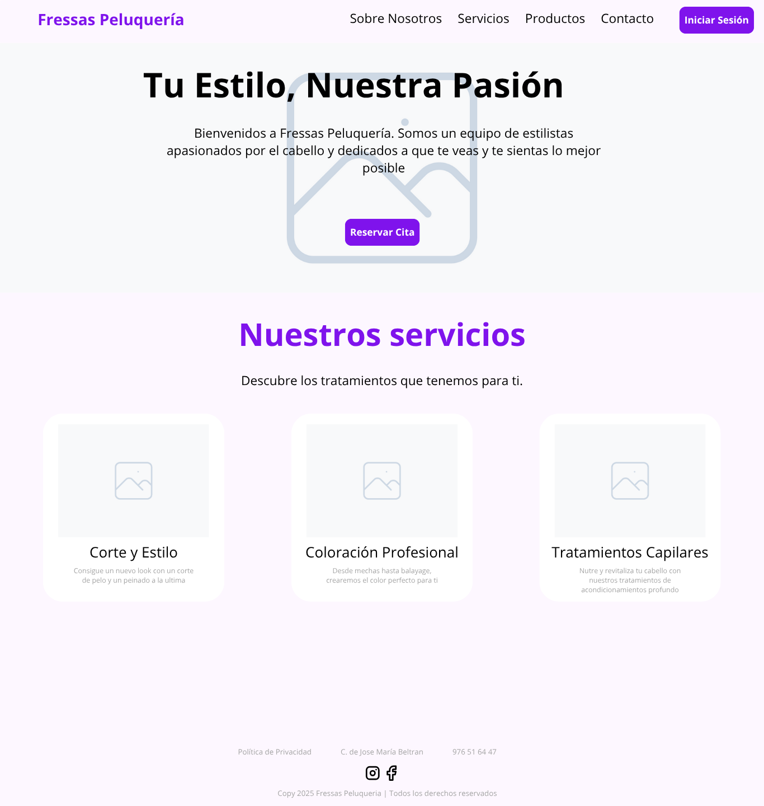
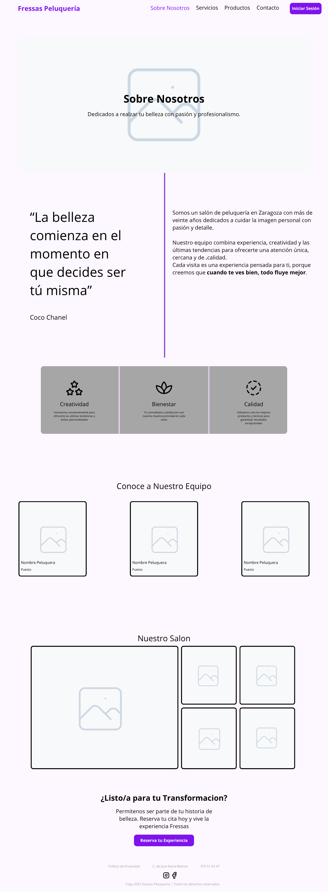
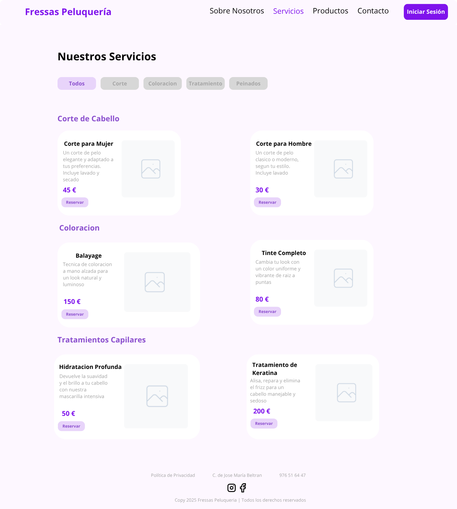
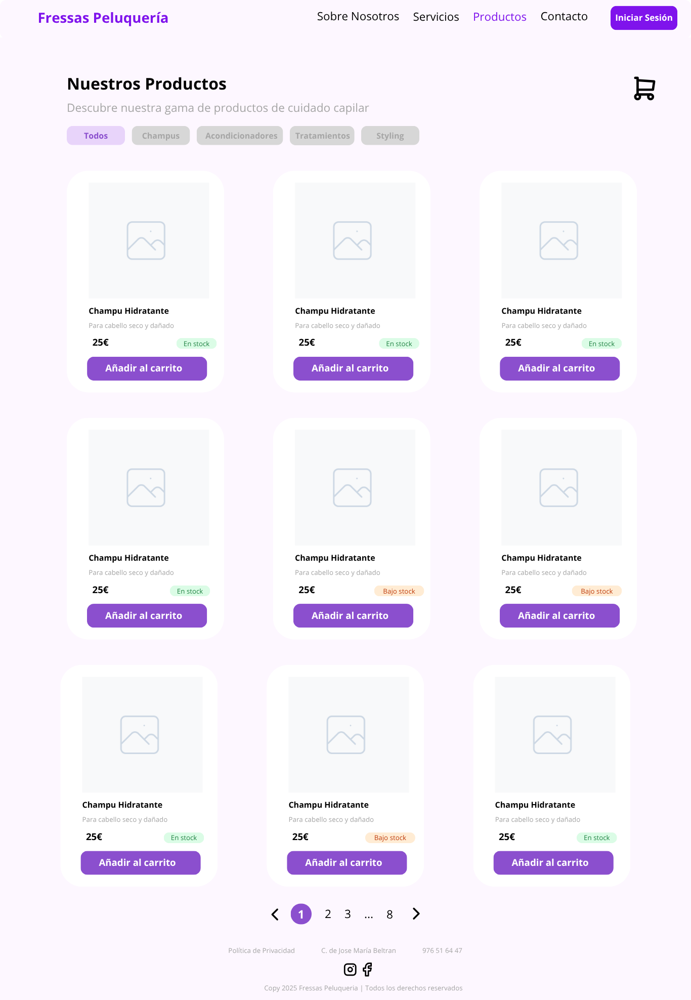
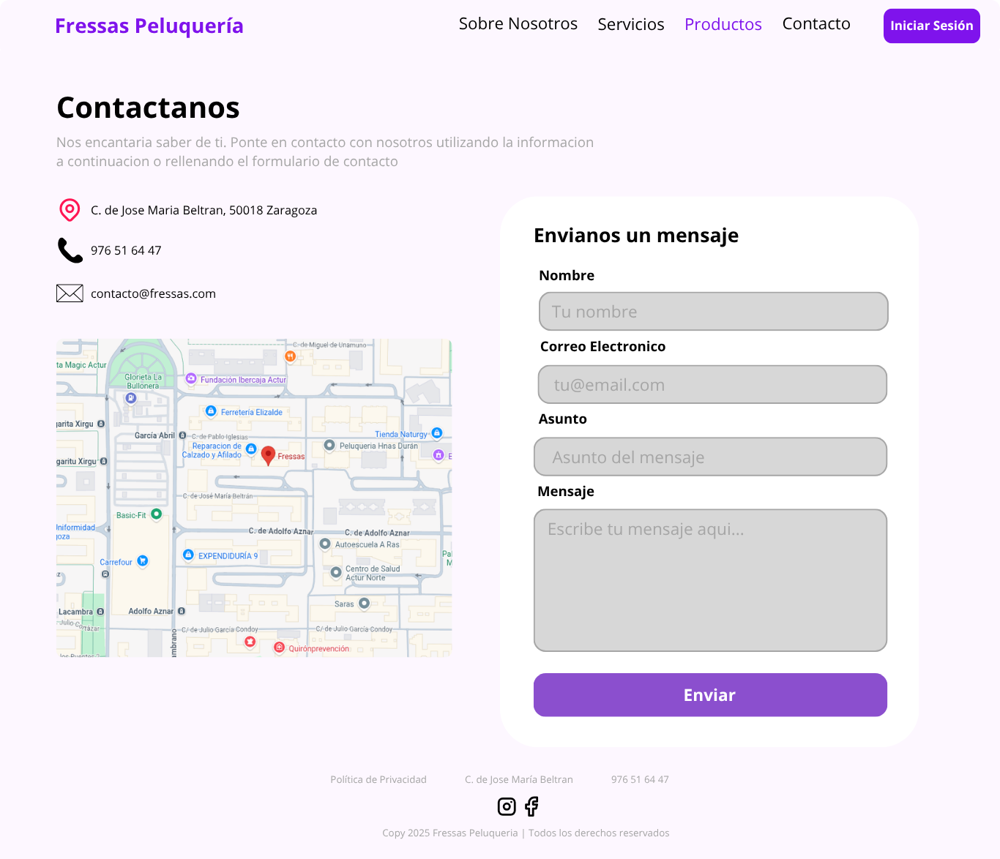
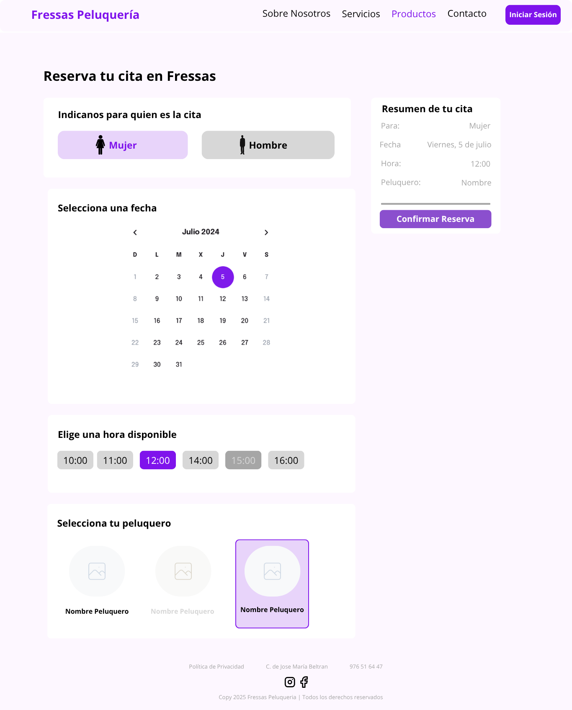
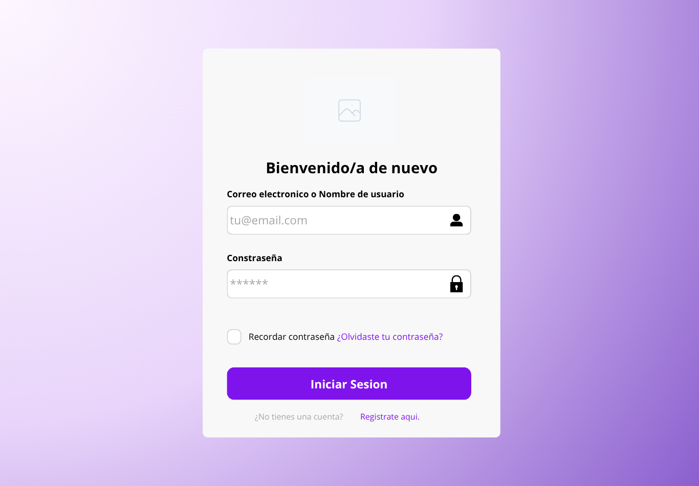
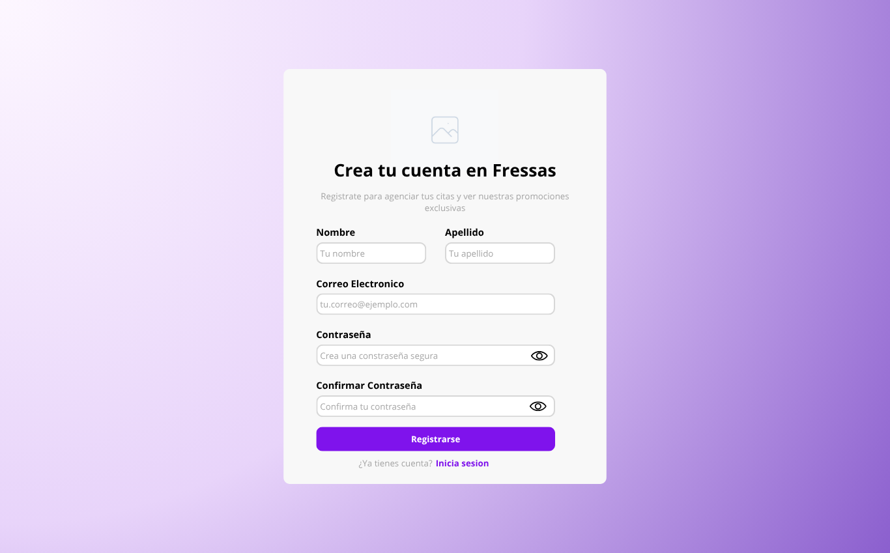

# TFG - Web para una peluqueria
 
Antes de comenzar con la implementacion, se ha realizado una **maquetacion inicial** de la web
 
Esto es un diseño inicial, el cual se tiene que **mejorar**
 
Hay que decidir aun la paleta de colores y la tipografia, ademas de los iconos que se vayan a usar
 
Sirve como base del proyecto
 
Imagenes del diseño inicial:
 
### Pagina principal (Inicio)

 
### Pagina Sobre Nosotros

 
### Pagina de servicios

 
### Pagina de productos

 
### Pagina de contacto

 
### Pagina de reservas

 
### Pagina de inicio de sesion

 
### Pagina de registro de usuario

